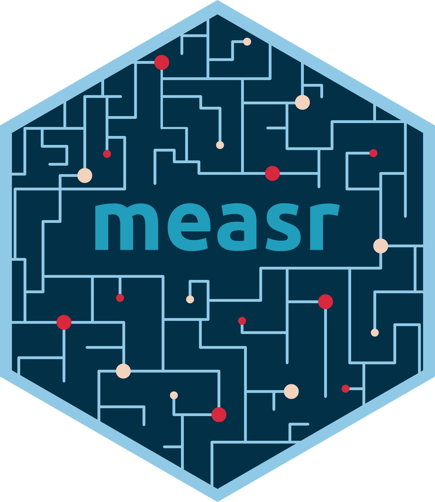
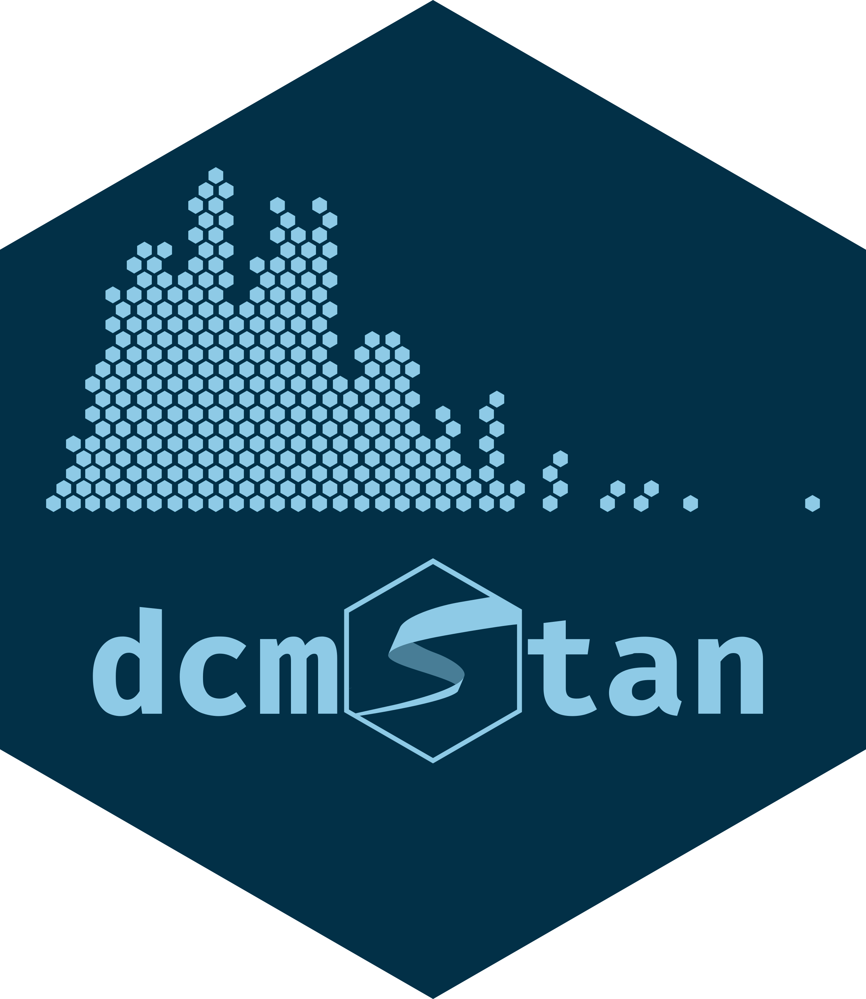
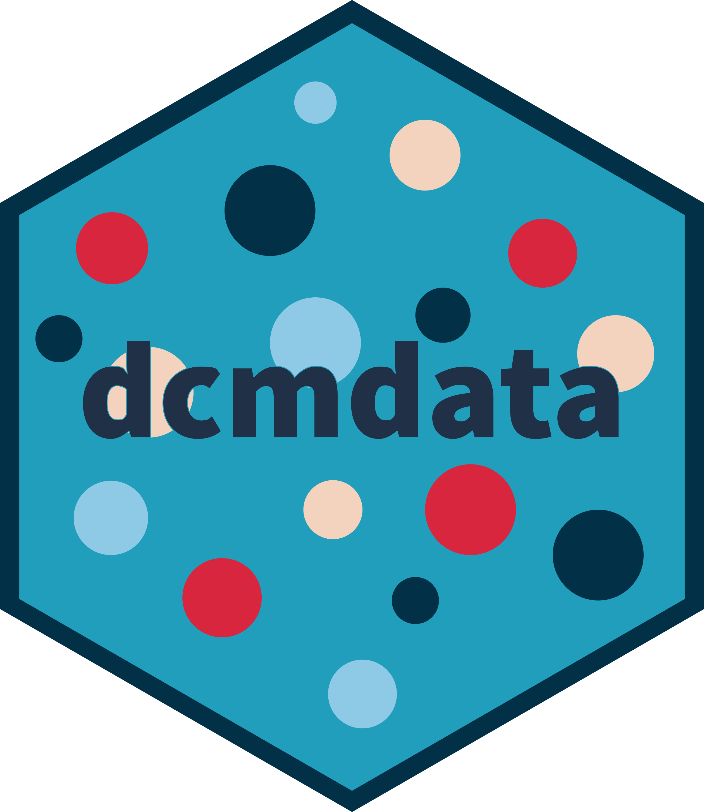
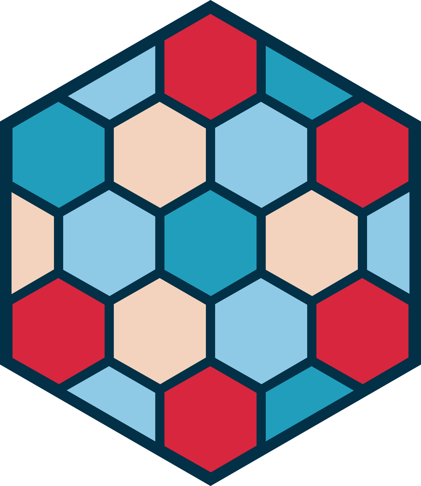

```{r}
#| label: setup
#| include: false

library(tidyverse)
library(ggmeasr)
library(knitr)
library(measr)
library(here)
library(gt)
library(gtExtras)

set_theme(plot_margin = margin(5, 0, 0, 0))

# gt theme ---------------------------------------------------------------------
gt_theme_rdcm <- function(gt_dat, bg_color = "#FFFFFF", ...) {
  gt_dat |>
    gt::opt_all_caps() |>
    gt::opt_table_font(
      font = list(gt::google_font("Open Sans"), gt::default_fonts())
    ) |>
    gt::tab_options(
      column_labels.background.color = bg_color,
      column_labels.border.top.width = gt::px(3),
      column_labels.border.top.color = bg_color,
      table.border.top.width = gt::px(1),
      table.border.bottom.width = gt::px(1),
      heading.align = "left",
      heading.background.color = bg_color,
      source_notes.padding = gt::px(10),
      source_notes.border.lr.width = gt::px(0),
      source_notes.font.size = 12,
      source_notes.background.color = bg_color,
      table.font.size = 16,
      data_row.padding = gt::px(3),
      table.background.color = bg_color,
      ...
    ) |>
    gt::tab_style(
      style = gt::cell_borders(
        sides = "bottom",
        color = "transparent",
        weight = gt::px(2)
      ),
      locations = gt::cells_body(
        columns = gt::everything(),
        rows = nrow(gt_dat$`_data`)
      )
    ) |>
    gt::tab_style(
      style = list(
        gt::cell_text(
          weight = "bold",
          align = "center",
          v_align = "middle",
          color = msr_colors[2]
        ),
        gt::cell_borders(
          sides = "bottom",
          color = msr_colors[2],
          weight = gt::px(3)
        )
      ),
      locations = gt::cells_column_labels(gt::everything())
    ) |>
    gt::tab_style(
      style = gt::cell_fill(color = bg_color),
      locations = list(gt::cells_body(
        columns = gt::everything(),
        rows = gt::everything()
      ))
    )
}
```

## Who am I?

:::{.columns}
:::{.column width="50%"}
<br>W. Jake Thompson, Ph.D.

* Assistant Director of Psychometrics
  * [ATLAS](https://atlas.ku.edu) | University of Kansas

* Research: Applications of diagnostic psychometric models
  * Lead psychometrician and Co-PI for the [Dynamic Learnings Maps](https://dynamiclearningmaps.org) assessments
  * PI for an [IES-funded](https://ies.ed.gov/funding/grantsearch/details.asp?ID=4546) project to develop software for diagnostic models
:::

:::{.column width="50%"}
:::{.center}

```{r}
#| label: profile-picture
#| out-width: 50%
#| fig-alt: |
#|   Profile picture for Jake Thompson.

include_graphics("figure/wjt-2022-hex.png")
```

:::{.end-links .centered}
 \ [@wjakethompson](https://www.gitub.com/wjakethompson)  
 \ [@wjakethompson.com](https://bsky.app/profile/wjakethompson.com)
:::
:::
:::
:::

# Section title

## Default Slide

Here is some **bold** and *italic* text.

* Bullets
  * And sub-bullets
* Another bullet

## Columns

:::columns
:::{.column width="45%"}
### Left column

- Point 1
- Point 2
- Point 3
:::

:::{.column width="45%"}
### Right column

- Point 4
- Point 5
- Point 6
:::
:::


## Code

```{r}
#| echo: TRUE
#| output-location: column
library(measr)

create_profiles(5)
```

## Code annotations

```r
starwars |>                            # <1>
  mutate(                              # <2>
    bmi = mass / ((height / 100) ^ 2), # <2>
    age_new_hope = birth_year + 4      # <2>
  )                                    # <2>
```
1. Take `starwars`, and then,
2. add new columns for the BMI and age in "Return of the Jedi"

## Output highlighting

```{r}
#| echo: true
#| code-line-numbers: "|8|10,11"

starwars |>
  mutate(
    bmi = mass / ((height / 100)^2),
    age_new_hope = birth_year + 4
  )
```


## Exercise 1 {.exercise}

Here is an exercise.



## {.exercise .no-rule data-menu-title="Solution 1"}

:::{.panel-tabset}
### Specify

```{r}
#| label: specifcy-sol
#| eval: false
#| echo: true

spec <- dcm_specify(
  qmatrix = ecpe_qmatrix,
  identifier = "item_id"
)
```

### Estimate

```{r}
#| label: estimate-sol
#| eval: false
#| echo: true

mod <- dcm_estimate(
  spec,
  data = ecpe_data,
  identifer = "resp_id"
)
```

:::

## Why DCMs

- Fine-grained, criterion-referenced feedback
- Classifications, not a single scale score
- Small item pools, fast turnaround


# {.empty-navy data-menu-title="measr" background-iframe="grid-worms/index.html"}

```{r}
#| label: big-image
#| out-width: 100%
#| fig-alt: "Hex logo for the measr R package."


```


## A heading with no rule {.no-rule}

`.no-rule` drops the red hex-tipped rule — for slides that open on a figure or
a single statement rather than a list.

# The suite

::: {.hex-row .large}
   
:::

## Fit a model with measr

::: columns
::: {.column width="48%"}
- One call to estimate an LCDM
- Stan or Mplus back ends
- Reliability and fit in a tidy tibble
:::

::: {.column width="52%"}
```{.r}
library(measr)

fit <- measr_dcm(
  data = mdm_data,
  qmatrix = mdm_qmatrix,
  type = "lcdm"
)
```
:::
:::

::: {.callout-tip}
Cached fits make re-rendering slides cheap.
:::

## Under the hood {.dark}

`.dark` puts any content slide on the navy field with the drifting light
hexagons. Bullets and inline code recolour to stay readable:

- Stan back end via `dcmstan`
- Data and Q-matrices from `dcmdata`

## A wide figure {.hex-quiet}

Use `.hex-quiet` when a plot needs the room.

## Small models, big claims {.hex-loud}

`.hex-loud` oversizes both clusters — save it for statement slides.

## A bare slide {.empty}

`.empty` removes every background element.

## Full-bleed on navy {.empty-navy}

`.empty-navy` is the same bare canvas on the navy field.


## Callouts

Each type carries its own tint and hex glyph from the palette.

:::{.columns}
:::{.column width="48%"}

::: {.callout-note}
## Note
Light blue field — supporting detail.
:::

::: {.callout-tip}
## Tip
Blue field — the practical aside.
:::

::: {.callout-warning}
## Warning
Red field — proceed carefully.
:::

:::

:::{.column width="4%"}
:::

:::{.column width="48%"}

::: {.callout-important}
## Important
Navy field — the thing not to miss.
:::

::: {.callout-caution}
## Caution
Cream field — a lighter flag.
:::

:::
:::


## Blockquotes

> Diagnostic models trade a single score for a profile of what a student
> actually knows.

The hex glyph is drawn with `blockquote::before` — no rule, no italics, no
quotation marks.

# [**r-dcm.org**](https://r-dcm.org) {.closing data-menu-title="Get in touch"}

:::{.columns .v-center-container}
:::{.column width="60%"}
```{r}
#| label: big-image
#| out-width: 50%
```

:::

:::{.column .end-links width="40%"}
 \ [wjakethompson.com](https://wjakethompson.com)  
 \ [wjakethompson@ku.edu](mailto:wjakethompson@ku.edu)  
 \ [in/wjakethompson](https://linkedin.com/in/wjakethompson)  
 \ [@wjakethompson](https://github.com/wjakethompson)  
 \ [@wjakethompson@fosstodon.org](https://fosstodon.org/@wjakethompson)  
 \ [@wjakethompson.com](https://bsky.app/profile/wjakethompson.com)  
 \ [@wjakethompson](https://www.threads.net/@wjakethompson)  
 \ [@wjakethompson](https://twitter.com/wjakethompson)  

:::

:::

## [**r-dcm.org**](https://r-dcm.org) {.closing data-menu-title="Get in touch"}

:::{.columns .v-center-container}
:::{.column width="60%"}
```{r}
#| label: big-image
#| out-width: 50%
```

:::

:::{.column .end-links width="40%"}
 \ [wjakethompson.com](https://wjakethompson.com)  
 \ [wjakethompson@ku.edu](mailto:wjakethompson@ku.edu)  
 \ [in/wjakethompson](https://linkedin.com/in/wjakethompson)  
 \ [@wjakethompson](https://github.com/wjakethompson)  
 \ [@wjakethompson@fosstodon.org](https://fosstodon.org/@wjakethompson)  
 \ [@wjakethompson.com](https://bsky.app/profile/wjakethompson.com)  
 \ [@wjakethompson](https://www.threads.net/@wjakethompson)  
 \ [@wjakethompson](https://twitter.com/wjakethompson)  

:::

:::

## Acknowledgements

The research reported here was supported by the Institute of Education Sciences, U.S. Department of Education, through Grants [R305D210045](https://ies.ed.gov/funding/grantsearch/details.asp?ID=4546) and [R305D240032](https://ies.ed.gov/funding/grantsearch/details.asp?ID=6075) to the University of Kansas Center for Research, Inc., ATLAS. The opinions expressed are those of the authors and do not represent the views of the Institute or the U.S. Department of Education.
<br><br>

:::{.columns}
:::{.column width="15%"}
:::

:::{.column width="70%"}

```{r}
#| label: ies-logo
#| out-width: 100%
#| fig-align: center
#| fig-alt: |
#|   Logo for the Institute of Education Sciences.


```

:::

:::{.column width="15%"}
:::
:::
